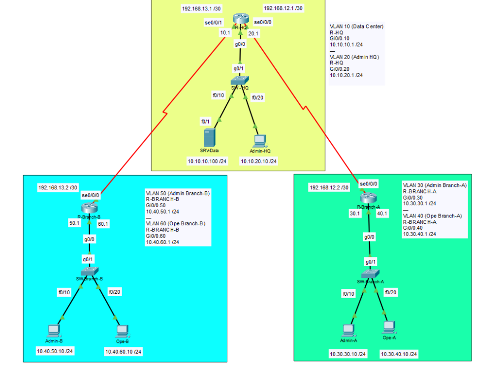

# Project 01: Multisite Corporate

[🇪🇸 Versión en Español](./README.md) | [🇬🇧 English Version](./README.en.md)

## 1. Project Summary

This document details the design, implementation, and security hardening of a multi-site enterprise network infrastructure. The architecture connects a Headquarter (HQ) office, hosting the corporate Data Center, with two remote branches (Branch-A and Branch-B) using a Hub-and-Spoke WAN design model.

The primary objective is to guarantee global connectivity through dynamic routing, optimize broadcast domains using VLAN segmentation, and apply strict security policies at Layers 3 and 4 of the OSI model to protect critical Data Center assets.

---

## 2. Topology Architecture



The network employs logical trunk connections to local switches and point-to-point serial links for WAN transport managed by the Central Hub:

- **Headquarters (HQ):** Acts as the central node (**Hub**). It hosts the critical data server in VLAN 10 and the local management network in VLAN 20.
- **Branch Offices (Branch-A / Branch-B):** Act as satellite nodes (**Spokes**). Each branch has two separate segments: Management VLAN and Operations VLAN. Traffic between branches must transit through HQ.

---

## 3. Technologies and Engineering Implementation

### A. Layer 2 Architecture (Switching)

* **VLAN Segmentation:** Broadcast domains are localized by department to improve performance and isolate network traffic.
- **802.1Q Trunks:** Manual trunk links were configured on all distribution ports connecting to the routers (Router-on-a-Stick).
- **Trunk Security (VLAN Pruning):** Allowed VLANs on trunks were manually restricted to mitigate security risks like *MAC-flooding* and optimize bandwidth utilization.

### B. Layer 3 Architecture (Routing)

* **Router-on-a-Stick (RoaS):** Inter-VLAN routing is accomplished using a single physical interface divided into logical subinterfaces with explicit encapsulation.
- **Point-to-Point WAN Links:** Serial interfaces operate under subnets with a `/30` prefix, incorporating clock synchronization (*Clock Rate*) on the terminals designated as DCE (R-HQ).

### C. Dynamic Routing Protocol (OSPFv2)

* **OSPF Single-Area:** Deployed in the Backbone Area (Area 0) to ensure immediate global convergence.
- **Passive Interfaces:** Interfaces facing user LANs were configured as passive. This blocks the transmission of OSPF Hello packets to end hosts, mitigating the risk of rogue router injection attacks and saving processing resources.

### D. Perimeter Security and Access Control (Layer 4 - ACLs)

A named extended access control list (`ACL-DC-PROTECT`) was implemented on router R-HQ to safeguard the Data Center, following the **Principle of Least Privilege**:
- **Management VLANs (All Sites):** Granted full IP access to the server for administration tasks.
- **Operations VLANs (Branches):** Strictly restricted to Web traffic (TCP ports 80 and 443). Any other protocol (such as ICMP Ping or FTP) is automatically discarded at the perimeter.

---

## 4. Logical Addressing Matrix

| Device | Interface / Subinterface | IP Address | Mask | VLAN / Element |
| :--- | :--- | :--- | :--- | :--- |
| **R-HQ** | GigabitEthernet0/0.10 | 10.10.10.1 | /24 | VLAN 10 (Data Center) |
| **R-HQ** | GigabitEthernet0/0.20 | 10.10.20.1 | /24 | VLAN 20 (HQ Admin) |
| **R-HQ** | Serial0/0/0 | 192.168.12.1 | /30 | WAN Link to Branch-A |
| **R-HQ** | Serial0/0/1 | 192.168.13.1 | /30 | WAN Link to Branch-B |
| **SRV-DATA** | Host Server | 10.10.10.100 | /24 | Gateway: 10.10.10.1 |
| **R-BRANCH-A** | GigabitEthernet0/0.30 | 10.30.30.1 | /24 | VLAN 30 (Branch-A Admin) |
| **R-BRANCH-A** | GigabitEthernet0/0.40 | 10.30.40.1 | /24 | VLAN 40 (Branch-A Ope) |
| **R-BRANCH-B** | GigabitEthernet0/0.50 | 10.40.50.1 | /24 | VLAN 50 (Branch-B Admin) |
| **R-BRANCH-B** | GigabitEthernet0/0.60 | 10.40.60.1 | /24 | VLAN 60 (Branch-B Ope) |

---

## 5. Verification and Control Syntax

Security Configuration on **R-HQ** (Console Output):

```text
R-HQ# show access-lists
Extended IP access list ACL-DC-PROTECT
    10 permit tcp 10.30.40.0 0.0.0.255 host 10.10.10.100 eq www
    20 permit tcp 10.30.40.0 0.0.0.255 host 10.10.10.100 eq 443
    30 permit tcp 10.40.60.0 0.0.0.255 host 10.10.10.100 eq www
    40 permit tcp 10.40.60.0 0.0.0.255 host 10.10.10.100 eq 443
    50 permit ip 10.10.20.0 0.0.0.255 host 10.10.10.100
    60 permit ip 10.30.30.0 0.0.0.255 host 10.10.10.100
    70 permit ip 10.40.50.0 0.0.0.255 host 10.10.10.100
    80 deny ip any host 10.10.10.100
```

- **Rule Location:** Applied on the `GigabitEthernet0/0.10` interface using the command `ip access-group ACL-DC-PROTECT out`.

---

## 📁 Repository Configuration Files

You can review the complete running configuration files (`startup-config`) of each device:

- [R-HQ Config](./configs/R-HQ_startup-config.txt)
- [R-Branch-A Config](./configs/R-Branch-A_startup-config.txt)
- [R-Branch-B Config](./configs/R-Branch-B_startup-config.txt)
- [SW-HQ Config](./configs/SW-HQ_startup-config.txt)
- [SW-Branch-A Config](./configs/SW-Branch-A_startup-config.txt)
- [SW-Branch-B Config](./configs/SW-Branch-B_startup-config.txt)
