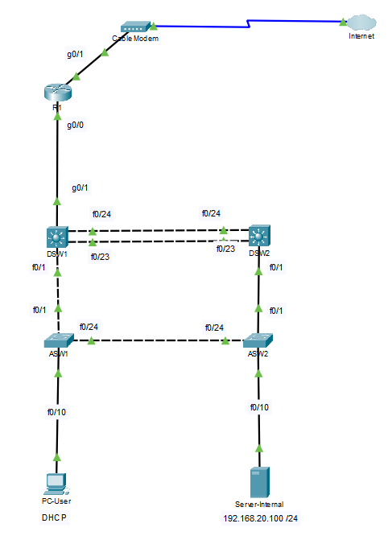

# Proyecto 02: Arquitectura de Enrutamiento Inter-VLAN Segura con LACP, PVST+ y DHCP

[🇬🇧 Read in English](./README.en.md) | [🇪🇸 Versión en Español](./README.md)

## 1. Resumen del Proyecto

Este documento detalla el diseño, implementación y endurecimiento (*hardening*) de seguridad de una infraestructura de red LAN corporativa de alta disponibilidad para una empresa mediana. La solución abarca desde la redundancia y agregación de enlaces en la Capa 2 hasta la automatización de servicios de direccionamiento y la seguridad perimetral de acceso en los puertos de usuario.

---

## 2. Arquitectura de la Topología y Diseño WAN

La red está estructurada bajo el modelo de diseño jerárquico clásico, dividida en las capas de **Distribución** (conmutación y control de bucles redundante) y **Acceso** (conectividad de terminales y políticas de seguridad).

### Diagrama Lógico de la Red



### Nota de Diseño WAN

* **Modo Puente (Bridge Mode) en Cable-Modem:** El dispositivo `Cable-Modem-0` actúa de manera transparente como un puente de Capa 2. Esto permite que la interfaz `GigabitEthernet0/1` del router de borde `R1` negocie directamente el direccionamiento IP público con el enrutador del ISP, evitando la sobrecarga de un doble NAT y garantizando un enrutamiento perimetral óptimo y limpio.

---

## 3. Esquema de Direccionamiento y VLANs

La red se ha segmentado en diferentes VLANs para reducir los dominios de broadcast, optimizar el rendimiento y aplicar políticas de control de tráfico específicas:

| VLAN ID | Nombre | Subred | Gateway IP | Propósito |
| :--- | :--- | :--- | :--- | :--- |
| **VLAN 10** | Usuarios | `192.168.10.0/24` | `192.168.10.1` | Clientes finales (VLAN de Operaciones) |
| **VLAN 20** | Servidores | `192.168.20.0/24` | `192.168.20.1` | Servicios internos y recursos corporativos |
| **VLAN 99** | Gestion | `192.168.99.0/24` | `192.168.99.1` | SVI de Switches (Gestión fuera de banda) |
| **WAN** | Link-to-ISP | `203.0.113.0/30` | `203.0.113.1` (ISP) | Enlace de salida a Internet pública |

### IPs de Gestión de Dispositivos (SVI VLAN 99)

* **DSW1:** `192.168.99.11`

* **DSW2:** `192.168.99.12`
* **ASW1:** `192.168.99.21`
* **ASW2:** `192.168.99.22`

---

## 4. Tecnologías Clave Implementadas

### A. EtherChannel (LACP)

Agregación de enlaces lógicos utilizando el protocolo estándar de la industria **LACP** (*Link Aggregation Control Protocol* - modo `active`) entre `DSW1` y `DSW2`. Agrupa las interfaces físicas `Fa0/23` y `Fa0/24` en un enlace lógico troncal denominado `Port-Channel 1` para duplicar el ancho de banda disponible y proporcionar tolerancia a fallos ante la desconexión física de cualquiera de los cables.

### B. PVST+ (Per-VLAN Spanning Tree)

Mitigación determinista de bucles en la Capa 2 utilizando Spanning Tree por VLAN. Se configuró:

* `DSW1` como **Root Bridge principal** para las VLANs 10 y 99.
* `DSW2` como **Root Bridge principal** para la VLAN 20.
Esta configuración distribuye de forma equilibrada la carga de tráfico STP (*STP Load Balancing*), evitando la infrautilización de los enlaces de backup lógicos.

### C. DHCP Relay Agent (`ip helper-address`)

Configuración en el Router `R1` para interceptar las solicitudes de broadcast de tipo *DHCP Discover* originadas por los clientes de la VLAN 10 y reordenarlas en paquetes unicast dirigidos al servidor central `Server-Internal` (`192.168.20.100`) ubicado en la VLAN 20. Esto permite la centralización del direccionamiento IP corporativo.

### D. Port-Security (Seguridad de Acceso)

Blindaje aplicado en las interfaces `Fa0/10` de los switches de acceso `ASW1` y `ASW2`:

* Límite de acceso fijado a un **máximo de 1 dirección MAC** por puerto.
* Aprendizaje persistente dinámico mediante **MAC Address Sticky**.
* Acción ante violaciones de seguridad configurada en modo **Shutdown**. Si se conecta un dispositivo con una dirección MAC no registrada, el puerto se apaga de inmediato y entra en estado *err-disable*.

### E. Spanning-Tree PortFast y BPDU Guard

* **PortFast:** Habilitado en los puertos de usuario para omitir los estados tradicionales de escucha y aprendizaje de STP, disminuyendo el tiempo de convergencia de 30 a 0 segundos al conectar un equipo.

* **BPDU Guard:** Protege la topología desactivando inmediatamente el puerto si detecta la recepción de tramas BPDU (lo que indicaría la conexión de otro switch no autorizado en los puertos de acceso).

### F. Administración Remota Segura (SSHv2)

* Deshabilitación total de conexiones no cifradas mediante Telnet.

* Generación de claves de cifrado RSA de alta seguridad.
* Habilitación y uso exclusivo de **SSHv2** para la gestión y administración segura de todos los equipos.

---

## 5. Comandos Esenciales de Configuración

### R1 (Subinterfaces Trunking & DHCP Relay)

```ios
interface GigabitEthernet0/0.10
 encapsulation dot1Q 10
 ip address 192.168.10.1 255.255.255.0
 ip helper-address 192.168.20.100
!
interface GigabitEthernet0/0.20
 encapsulation dot1Q 20
 ip address 192.168.20.1 255.255.255.0
!
interface GigabitEthernet0/0.99
 encapsulation dot1Q 99 native
 ip address 192.168.99.1 255.255.255.0
```

### DSW1 (EtherChannel & STP Primario)

```ios
interface range FastEthernet 0/23 - 24
 channel-protocol lacp
 channel-group 1 mode active
!
interface Port-Channel 1
 switchport mode trunk
 switchport trunk native vlan 99
 switchport trunk allowed vlan 10,20,99
!
spanning-tree mode pvst
spanning-tree vlan 10,99 root primary
spanning-tree vlan 20 root secondary
```

### ASW1 (Port-Security & Hardening en Acceso)

```ios
interface FastEthernet0/10
 switchport mode access
 switchport access vlan 10
 switchport port-security
 switchport port-security maximum 1
 switchport port-security violation shutdown
 switchport port-security mac-address sticky
 spanning-tree portfast
 spanning-tree bpduguard enable
```

---

## 6. Verificación y Diagnóstico

### EtherChannel Summary en DSW1

```text
DSW1# show etherchannel summary
Group  Port-channel  Protocol    Ports
------+-------------+-----------+-----------------------------------------------
1      Po1(SU)         LACP      Fa0/23(P)   Fa0/24(P)   
```

* **Estado validado:** El canal `Po1` se encuentra activo en estado `SU` (S: Capa 2, U: En uso) y los puertos miembros físicos en estado `P` (En Port-Channel), confirmando el correcto funcionamiento de LACP.

### Spanning Tree en DSW1 (VLAN 10)

```text
DSW1# show spanning-tree vlan 10
VLAN0010
  Spanning tree enabled protocol ieee
  Root ID    Priority    24586
             Address     00D0.FF0E.AA01
             This bridge is the root
```

* **Estado validado:** Confirmación manual del rol de `Root Bridge` para la VLAN 10 en DSW1, garantizando la predictibilidad del flujo de datos en la Capa 2.

### Diagnóstico de Direccionamiento IP en PC-User

```text
PC-User> ipconfig /all
Physical Address................: 00E0.F794.7C28
IP Address......................: 192.168.10.11
Subnet Mask.....................: 255.255.255.0
Default Gateway.................: 192.168.10.1
DHCP Server.....................: 192.168.20.100
```

* **Estado validado:** La IP `192.168.10.11` ha sido asignada dinámicamente y el gateway apunta a la subinterfaz de `R1`, validando la intermediación del DHCP Relay.

### Seguridad del Puerto en ASW1

```text
ASW1# show port-security interface fa0/10
Port Security              : Enabled
Port Status                : Secure-up
Violation Mode             : Shutdown
Maximum MAC Addresses      : 1
Total MAC Addresses        : 1
Sticky MAC Addresses       : 1
Last Source Address:Vlan    : 00E0.F794.7C28:10
Security Violation Count   : 0
```

* **Estado validado:** Puerto operando en estado seguro (`Secure-up`), con la dirección MAC del host grabada como `Sticky` de forma persistente y el contador de violaciones en cero.

---

## 📁 Archivos de Configuración del Repositorio

Puedes inspeccionar los respaldos completos de las configuraciones en ejecución (`startup-config`) de cada dispositivo:

* [R1 Config](./configs/R1_startup-config.txt)
* [DSW1 Config](./configs/DSW1_startup-config.txt)
* [DSW2 Config](./configs/DSW2_startup-config.txt)
* [ASW1 Config](./configs/ASW1_startup-config.txt)
* [ASW2 Config](./configs/ASW2_startup-config.txt)

---
*Este laboratorio demuestra la aplicación práctica de diseño robusto, redundante y altamente seguro bajo los estándares de la certificación de redes Cisco CCNA.*
