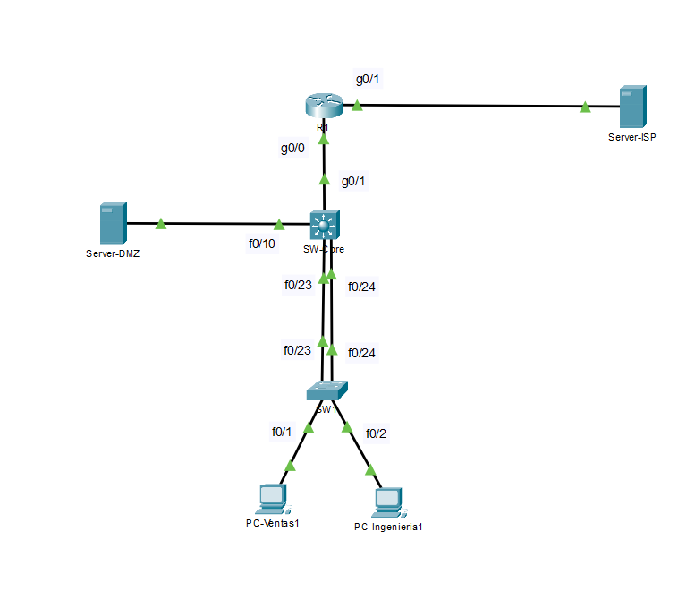

# Proyecto 03: Red Multicapa con Switch L3 (SVI), EtherChannel LACP, NAT/PAT y ACL Extendida

[🇬🇧 Read in English](./README.en.md) | [🇪🇸 Versión en Español](./README.md)

---

## 1. Resumen del Proyecto

Este proyecto implementa una red corporativa utilizando un **Switch de Capa 3 (Cisco 3560)** para realizar el enrutamiento entre VLANs mediante **Interfaces Virtuales de Switch (SVIs)**.

El objetivo principal es interconectar los departamentos de **Ventas** e **Ingeniería** con una zona de servidores (**DMZ**), garantizando alta disponibilidad mediante **EtherChannel LACP**, salida a Internet con **NAT/PAT Overload** en un router de borde (`R1`), y seguridad mediante **ACLs extendidas** y **Port-Security**.

---

## 2. Arquitectura de la Topología y Diseño WAN

La infraestructura adopta un modelo jerárquico con un switch principal de **Capa 3** (`SW-Core`) y un switch de **Acceso** (`SW1`), conectados a un router de borde (`R1`) para la salida a Internet.

### Diagrama Lógico de la Red



### Notas de Arquitectura

* **Switching de Capa 3 (SVI):** El enrutamiento entre las VLANs 10, 20 y 30 lo realiza directamente el switch `SW-Core` con `ip routing`, logrando mayor velocidad y liberando de carga al router.
* **Enlace de Tránsito `/30`:** La conexión entre `SW-Core` y el router `R1` usa una interfaz enrutada L3 (`GigabitEthernet0/1` con `no switchport`) en la subred `10.0.0.0/30`.

---

## 3. Esquema de Direccionamiento y VLANs

La red se dividió en subredes independientes para aislar el tráfico por departamentos y servicios:

| VLAN / Enlace | Nombre | Subred | Gateway IP / SVI | Propósito |
| :--- | :--- | :--- | :--- | :--- |
| **VLAN 10** | Ventas | `192.168.10.0/24` | `192.168.10.1` | Equipos del Departamento de Ventas |
| **VLAN 20** | Ingenieria | `192.168.20.0/24` | `192.168.20.1` | Equipos del Departamento de Ingeniería |
| **VLAN 30** | DMZ | `192.168.30.0/24` | `192.168.30.1` | Zona de Servidores (`Server-DMZ` `192.168.30.10`) |
| **Tránsito L3** | SW-Core ↔ R1 | `10.0.0.0/30` | `10.0.0.1` (R1) / `10.0.0.2` (SW-Core) | Enlace interno hacia el router de borde |
| **WAN Pública** | ISP Link | `200.100.50.0/24` | `200.100.50.254` (R1 WAN) | Salida a Internet (Servidor ISP `200.100.50.1`) |

---

## 4. Tecnologías Clave Implementadas

### A. Enrutamiento Inter-VLAN con SVIs (Switch L3)
Configuración de `ip routing` en el switch `SW-Core` para procesar el tráfico entre las VLANs 10, 20 y 30 a través de sus respectivas SVIs (`Vlan10`, `Vlan20` y `Vlan30`).

### B. EtherChannel Dinámico (LACP 802.3ad)
Agregación de los puertos físicos `Fa0/23` y `Fa0/24` en un único enlace lógico troncal (**`Port-Channel 1`**) entre `SW1` y `SW-Core` usando LACP en modo `active`, aumentando el ancho de banda a 200 Mbps y proporcionando redundancia.

### C. Zona Desmilitarizada (DMZ / VLAN 30)
Creación de un segmento aislado para servidores (`Server-DMZ` `192.168.30.10/24`), evitando el acceso directo no autorizado desde los equipos de usuarios.

### D. Salida a Internet con NAT/PAT Overload
Configuración de NAT en el router `R1` (`ip nat inside` / `outside` y `NAT-ACL`) para traducir las direcciones IP privadas internas (`192.168.0.0/16`) a una IP pública y permitir la navegación externa hacia `Server-ISP`.

### E. Seguridad con ACL Extendida Nombrada (`DMZ-SECURITY-POLICY`)
Aplicación de una ACL extendida en `interface Vlan10` en sentido de entrada (`in`):
* **Tráfico Web a la DMZ:** Permite HTTP (`port 80`) y HTTPS (`port 443`) hacia el `Server-DMZ`.
* **Bloqueo Inter-VLAN:** Bloquea el tráfico IP directo desde Ventas (`192.168.10.0/24`) hacia Ingeniería (`192.168.20.0/24`).
* **Acceso a Internet:** Permite el resto del tráfico (`permit ip any any`) para salir a través de NAT.

### F. Port-Security en Puertos de Acceso
Seguridad en los puertos de usuario de `SW1` (`Fa0/1` y `Fa0/2`):
* Límite de **1 dirección MAC** por puerto.
* Aprendizaje de MAC mediante **`sticky`**.
* Acción de violación en modo **`restrict`** para bloquear dispositivos no autorizados.

---

## 5. Comandos Esenciales de Configuración

### SW-Core (Switch Capa 3 Cisco 3560)

```ios
! Habilitar Enrutamiento L3 y VLANs
ip routing
vlan 10
 name Ventas
vlan 20
 name Ingenieria
vlan 30
 name DMZ

! Configurar Port-Channel LACP
interface range FastEthernet0/23 - 24
 switchport mode trunk
 channel-group 1 mode active
!
interface Port-channel 1
 switchport mode trunk

! Puerto Enrutado a Router R1
interface GigabitEthernet0/1
 no switchport
 ip address 10.0.0.2 255.255.255.252
 no shutdown

! Configurar SVIs y Aplicar ACL
interface Vlan10
 ip address 192.168.10.1 255.255.255.0
 ip access-group DMZ-SECURITY-POLICY in
 no shutdown

interface Vlan20
 ip address 192.168.20.1 255.255.255.0
 no shutdown

interface Vlan30
 ip address 192.168.30.1 255.255.255.0
 no shutdown

! ACL Extendida y Ruta Defecto
ip access-list extended DMZ-SECURITY-POLICY
 permit tcp 192.168.0.0 0.0.255.255 host 192.168.30.10 eq www
 permit tcp 192.168.0.0 0.0.255.255 host 192.168.30.10 eq 443
 deny ip 192.168.10.0 0.0.0.255 192.168.20.0 0.0.0.255
 permit ip any any

ip route 0.0.0.0 0.0.0.0 10.0.0.1
```

### R1 (Router de Borde & NAT/PAT)

```ios
! Interfaces LAN y WAN
interface GigabitEthernet0/0
 ip address 10.0.0.1 255.255.255.252
 ip nat inside
 no shutdown

interface GigabitEthernet0/1
 ip address 200.100.50.254 255.255.255.0
 ip nat outside
 no shutdown

! Configuracion NAT Overload (PAT)
ip access-list standard NAT-ACL
 permit 192.168.0.0 0.0.255.255

ip nat inside source list NAT-ACL interface GigabitEthernet0/1 overload
ip route 192.168.0.0 255.255.0.0 10.0.0.2
```

---

## 6. Verificación y Diagnóstico

### A. Estado de EtherChannel LACP en SW-Core

```text
SW-Core# show etherchannel summary
Group  Port-channel  Protocol    Ports
------+-------------+-----------+-----------------------------------------------
1      Po1(SU)         LACP      Fa0/23(P)   Fa0/24(P)   
```
* **Verificación:** El enlace `Po1` está en uso (`SU`) y ambos puertos están activos en la agregación (`P`).

### B. Estado de la ACL Extendida en SW-Core

```text
SW-CORE# show access-lists
Extended IP access list DMZ-SECURITY-POLICY
    10 permit tcp 192.168.0.0 0.0.255.255 host 192.168.30.10 eq www
    20 permit tcp 192.168.0.0 0.0.255.255 host 192.168.30.10 eq 443
    30 deny ip 192.168.10.0 0.0.0.255 192.168.20.0 0.0.0.255
    40 permit ip any any
```
* **Verificación:** La lista está correctamente ordenada y vinculada a la `interface Vlan10`.

### C. Pruebas de Conectividad (Ping)

* **Aislamiento entre Ventas e Ingeniería (`PC-Ventas1` ➔ `PC-Ingenieria1` `192.168.20.11`):**
  ```text
  PC-Ventas1> ping 192.168.20.11
  Request timed out. (100% Pérdida - Bloqueado correctamente por la ACL)
  ```
* **Navegación a Internet WAN (`PC-Ventas1` ➔ `Server-ISP` `200.100.50.1`):**
  ```text
  PC-Ventas1> ping 200.100.50.1
  Reply from 200.100.50.1: bytes=32 time<1ms TTL=126 (0% Pérdida - Traducido por NAT/PAT)
  ```

---

## 7. Archivos de Configuración del Repositorio

Archivos de configuración (`startup-config`) extraídos de cada equipo:

* [SW-Core Config](./configs/SW-Core-config.txt)
* [SW1 Config](./configs/SW1-config.txt)
* [R1 Config](./configs/R1-config.txt)
