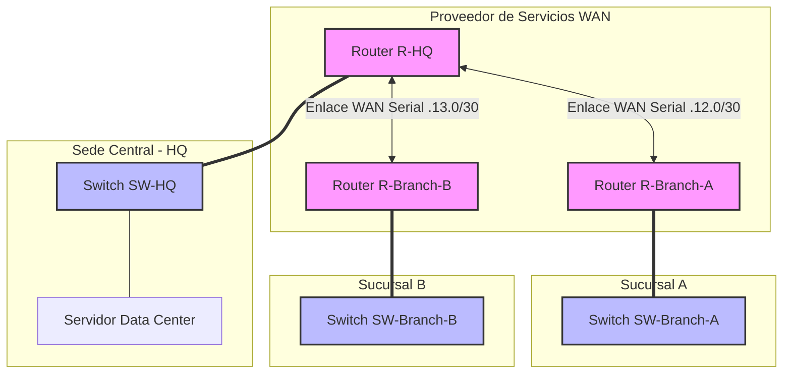

# Proyecto 01: Multisite Corporate

Este proyecto detalla el diseño, implementación y endurecimiento de seguridad de una infraestructura de red empresarial multi-sede.

---

## 1. Resumen del Proyecto

Este documento detalla el diseño, implementación y endurecimiento de seguridad de una infraestructura de red empresarial multi-sede. La arquitectura conecta una Oficina Central (HQ), donde reside el Data Center corporativo, con dos sucursales remotas (Branch-A y Branch-B) utilizando un modelo WAN Hub-and-Spoke.

El objetivo principal es garantizar la conectividad global mediante enrutamiento dinámico, optimizar los dominios de broadcast con segmentación de VLANs y aplicar políticas de seguridad estrictas en las Capas 3 y 4 del modelo OSI para proteger los activos críticos del Data Center.

---

## 2. Arquitectura de la Topología


La red utiliza conexiones lógicas troncales hacia los switches locales y enlaces seriales punto a punto para el transporte WAN administrado por el Hub Central:

- **Sede Central (HQ):** Actúa como el nodo central (**Hub**). Aloja el servidor crítico de datos en la VLAN 10 y la red de administración local en la VLAN 20.
- **Sucursales (Branch-A / Branch-B):** Actúan como nodos satélite (**Spokes**). Cada una cuenta con dos segmentos separados: VLAN de Administración y VLAN de Operaciones. El tráfico entre sucursales transita obligatoriamente a través de HQ.




---

## 3. Tecnologías e Implementación Ingenieril

### A. Arquitectura de Capa 2 (Switching)
* **Segmentación por VLANs:** Los dominios de broadcast están localizados por departamento para mejorar el rendimiento y aislar el tráfico.
* **Troncales 802.1Q:** Se configuraron enlaces troncales manuales en todos los puertos de distribución hacia los routers (Router-on-a-Stick).
* **Seguridad en Troncales (VLAN Pruning):** Se restringieron manualmente las VLANs permitidas en los troncales para mitigar riesgos de seguridad como el *MAC-flooding* y optimizar el ancho de banda.

### B. Arquitectura de Capa 3 (Routing)
* **Router-on-a-Stick (RoaS):** El enrutamiento inter-VLAN se logra utilizando una única interfaz física dividida en subinterfaces lógicas con encapsulación explícita.
* **Enlaces WAN Punto a Punto:** Las interfaces seriales operan bajo subredes con prefijo `/30`, incorporando la sincronización de reloj (*Clock Rate*) en los terminales asignados como DCE (R-HQ).

### C. Protocolo de Enrutamiento Dinámico (OSPFv2)
* **OSPF Single-Area:** Desplegado en el Área de Backbone (Área 0) para asegurar una convergencia global inmediata.
* **Interfaces Pasivas (Passive Interfaces):** Las interfaces orientadas a las LAN de los usuarios fueron configuradas como pasivas. Esto bloquea el envío de paquetes Hello de OSPF hacia los hosts finales, mitigando ataques de inyección de routers falsos y ahorrando procesamiento.

### D. Seguridad Perimetral y Control de Acceso (Capa 4 - ACLs)
Se implementó una lista de acceso extendida nombrada (`ACL-DC-PROTECT`) en el router R-HQ para salvaguardar el Data Center, siguiendo el **Principio de Mínimo Privilegio**:
* **VLANs de Administración (Todas las sedes):** Tienen permitido acceso IP total al servidor para tareas de gestión.
* **VLANs de Operaciones (Sucursales):** Restringidas estrictamente al tráfico Web (puertos TCP 80 y 443). Cualquier otro protocolo (como ICMP Ping o FTP) es descartado automáticamente en el perímetro.

---

## 4. Matriz de Direccionamiento Lógico

| Dispositivo | Interfaz / Subinterfaz | Dirección IP | Máscara | VLAN / Elemento |
| :--- | :--- | :--- | :--- | :--- |
| **R-HQ** | GigabitEthernet0/0.10 | 10.10.10.1 | /24 | VLAN 10 (Data Center) |
| **R-HQ** | GigabitEthernet0/0.20 | 10.10.20.1 | /24 | VLAN 20 (Admin HQ) |
| **R-HQ** | Serial0/0/0 | 192.168.12.1 | /30 | Enlace WAN a Branch-A |
| **R-HQ** | Serial0/0/1 | 192.168.13.1 | /30 | Enlace WAN a Branch-B |
| **SRV-DATA** | Host Servidor | 10.10.10.100 | /24 | Gateway: 10.10.10.1 |
| **R-BRANCH-A** | GigabitEthernet0/0.30 | 10.30.30.1 | /24 | VLAN 30 (Admin Branch-A) |
| **R-BRANCH-A** | GigabitEthernet0/0.40 | 10.30.40.1 | /24 | VLAN 40 (Ope Branch-A) |
| **R-BRANCH-B** | GigabitEthernet0/0.50 | 10.40.50.1 | /24 | VLAN 50 (Admin Branch-B) |
| **R-BRANCH-B** | GigabitEthernet0/0.60 | 10.40.60.1 | /24 | VLAN 60 (Ope Branch-B) |

---

## 5. Verificación y Sintaxis de Control

Configuración de Seguridad en **R-HQ** (Salida de Consola):

```text
R-HQ# show access-lists
Extended IP access list ACL-DC-PROTECT
    10 permit tcp 10.30.40.0 0.0.0.255 host 10.10.10.100 eq www
    20 permit tcp 10.30.40.0 0.0.0.255 host 10.10.10.100 eq 443
    30 permit tcp 10.40.60.0 0.0.0.255 host 10.10.10.100 eq www
    40 permit tcp 10.40.60.0 0.0.0.255 host 10.10.10.100 eq 443
    50 permit ip 10.10.20.0 0.0.0.255 host 10.10.10.100
    60 permit ip 10.30.30.0 0.0.0.255 host 10.10.10.100
    70 permit ip 10.40.50.0 0.0.0.255 host 10.10.10.100
    80 deny ip any host 10.10.10.100
```

* **Ubicación de la regla:** Aplicada en la interfaz `GigabitEthernet0/0.10` bajo el comando `ip access-group ACL-DC-PROTECT out`.

---

## 📁 Archivos de Configuración del Repositorio

Puedes consultar los archivos de configuración completos de cada equipo:

* [R-HQ_startup-config.txt](file:///c:/Users/jarsa/Documents/GitHub/labs-ccna/proyecto-01-multisite-corporate/configs/R-HQ_startup-config.txt)
* [R-Branch-A_startup-config.txt](file:///c:/Users/jarsa/Documents/GitHub/labs-ccna/proyecto-01-multisite-corporate/configs/R-Branch-A_startup-config.txt)
* [R-Branch-B_startup-config.txt](file:///c:/Users/jarsa/Documents/GitHub/labs-ccna/proyecto-01-multisite-corporate/configs/R-Branch-B_startup-config.txt)
* [SW-HQ_startup-config.txt](file:///c:/Users/jarsa/Documents/GitHub/labs-ccna/proyecto-01-multisite-corporate/configs/SW-HQ_startup-config.txt)
* [SW-Branch-A_startup-config.txt](file:///c:/Users/jarsa/Documents/GitHub/labs-ccna/proyecto-01-multisite-corporate/configs/SW-Branch-A_startup-config.txt)
* [SW-Branch-B_startup-config.txt](file:///c:/Users/jarsa/Documents/GitHub/labs-ccna/proyecto-01-multisite-corporate/configs/SW-Branch-B_startup-config.txt)
